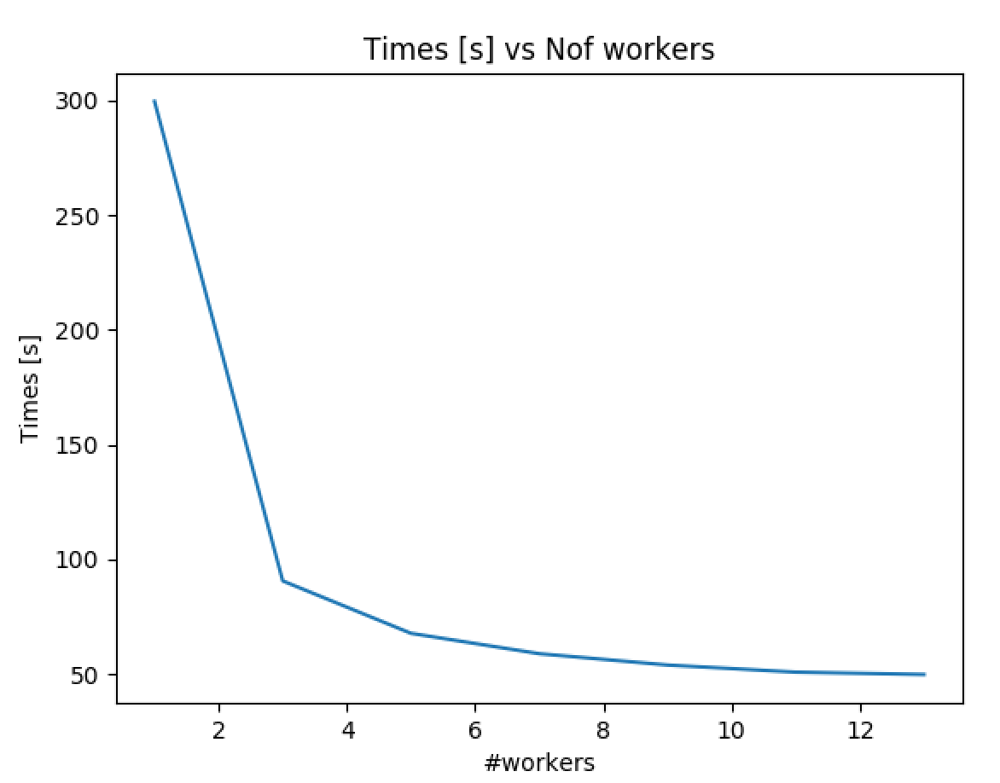

# HSCPTreeAnalyzer

## Setup
 - ROOT vesion >= 6.14
 - python3

## Goals of the package:
 - running over the TTree produced by Analyzer.cc in [SUSYBSMAnalysis-HSCP](https://github.com/CMS-HSCP/SUSYBSMAnalysis-HSCP)
 - parallelize the processing through the use of TProof-lite
 - produce the bunch of plots used to predict & valide the background prediction
 - ease the implementation of additional plots through the use of python scripts

## Tools/methods used:
 - TProof
 - TTreeReader (Value or Array) to simply the syntax (single line)
 - Use config files where the selections/variables are stored. See cfg directory
 - Use python script to generate the code to be compiled/executed
 - Use csv file and pandas

Classes are defined in inc/ src/ directory and compiled into a library libTools.so.
This library needs to be loaded in root macros.

## Usage
 - Compile the classes
 > ./compile.sh
 - Write down HSCP preselections in cfg/HSCPpreSelections.csv
 - Write down variables of HSCP you want to display in cfg/Variable.csv
 - In python directory, run
 > python3 CreateSelector.py
 It will create file HSCPSelector (.h and .C) in macros
 - In macros directory, run 
 > time root -l -b -q macro.cc
 You can change the input files and the number of workers in macro.cc
 - You can also simply launch:
 > ./launch
 - In case of issues, you can kill all proof instances
 > ./killproof.sh

## To-do for Eric:
 - [x] remove useless TTreeReader Value/Array (tests seems that it does not improve the execution time)
 - [x] add patterns to add variables
 - [x] add HSCP selection
 - [x] add patterns to change the selection
 - [x] add a selection of a single HSCP candidate per event (most ionizing)
 - [x] write the associated python scripts
 - [x] create a macros directory and move code
 - compile.sh changed into a Makefile

## To-do for Raphael:
 -  Change binning of MassRegionPlots
 -  Add MassRegionPlots for all quantiles
 -  Port all required pieces of code from Dylan's code
 -  Check the code compatibility by running background prediction macros
 -  Clean the code to avoid hard- coded values and becoming configurable (binning, quantiles, ...)
 -  Check #nodes optimization
 -  Update CPlots class to hadd 2D and eventually TProfile
 -  Add configuration for 2D plots & TProfile
 -  If needed: add plots at other level than preselection or for other quantities (event based or cluster based)
 -  fix the storage of TCanvas (duplicate name)
 -  fix issue with K & C global variable
 -  check the usage of references in classes/functions

Documentation about parallalization:
 - More documentation about TProof can be found [here](https://root.cern/download/proof.pdf).
 - Ideas about other usage of parallelization with root can be found [here](https://iopscience.iop.org/article/10.1088/1742-6596/898/7/072022/pdf)
